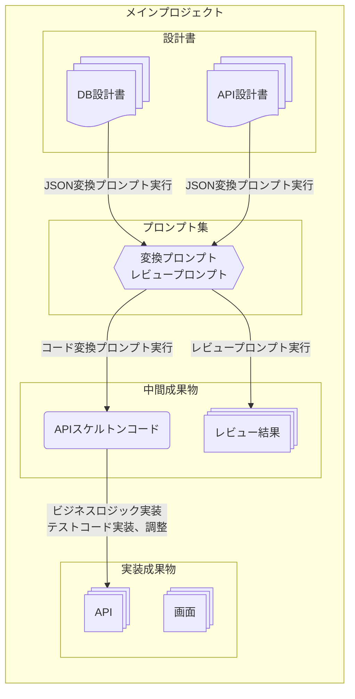

# Simple contract management system ドキュメント統制・AIガバナンス総合開発環境

エンタープライズ開発におけるドキュメント統制・AIガバナンスの実証実験

## 概要

シンプルなDBとAPI、画面を持つシステムをサンプルとした、エンタープライズ開発におけるドキュメント統制・AIガバナンスの実証実験です。本プロジェクトは、システム設計、ガバナンス設計、構築等の学習及び著者の技術スタック棚卸しのために作成したもので、複数のコンポーネントを**Gitサブモジュール**として連携させる形で作成されています。

本プロジェクト(及びそのサブモジュール)は、厳密なドキュメント統制と、CI工程にAIレビューを組み込むことによる、DevOpsの向上を企図して設計されています。

## 沿革

- **第1.0版** DB設計書、API設計書からのドキュメント統制・AIガバナンスのフローを完成
- **第1.5版(現行)** 画面資産を手作りし、画面とバックエンド資産の疎通が取れることを確認
- **第2.0版(検討中)** 画面資産への、ドキュメント統制・AIガバナンスのフロー設計

## プロジェクト構成

すべてのコンポーネントは独立したリポジトリとしてGitサブモジュールで管理されています。

- **メインプロジェクト(本プロジェクト)** 開発コンテナの定義やプロジェクト全体の設定・統括に必要なファイル
- [**DB設計書(サブモジュール)**](https://github.com/ryo-ichikawa-0308/scms-db-docs) データベース設計マニュアルと、データベース定義書サンプル
- [**API設計書(サブモジュール)**](https://github.com/ryo-ichikawa-0308/scms-api-docs) 画面からのエンドポイントになるAPIの設計マニュアルと、API設計書サンプル
- [**プロンプト集(サブモジュール)**](https://github.com/ryo-ichikawa-0308/scms-prompts) AIガバナンスとして用いた、あるいはコード生成に用いたプロンプト
- [**API(サブモジュール)**](https://github.com/ryo-ichikawa-0308/scms-api) 上記プロンプトによるAIの出力結果に基づいて実装したAPIのコード
- [**画面(サブモジュール)**](https://github.com/ryo-ichikawa-0308/scms-screen) API動作検証用画面のコード
- **sandbox(管理対象外)** 開発者の一時的なファイルを保存するためのディレクトリ(開発コンテナインストール時に自動生成)

各サブモジュールは下記のように連携しています。



※中間成果物は管理対象外

## プロジェクトダウンロード方法

本プロジェクトのダウンロードと開発環境のセットアップには、**WSL(もしくはLinux)**、**VS Code**、および**Docker**が必要です。他の環境でも可能かもしれませんが、著者は検証をしていません。

### 1. メインプロジェクトのクローン

WSLまたはLinuxターミナルで本プロジェクトをクローンしてください。

```bash
git clone --recurse-submodules https://github.com/ryo-ichikawa-0308/simple-contract-management-system.git
```

### 2. 開発コンテナの起動

クローン後、VS Codeで本プロジェクトを開くと、自動的に開発コンテナのビルドと起動が促されます。

```bash
cd simple-contract-management-system
code .
```

- **初回起動時**にDocker Composeによるビルドが行われ、Node.js、Python、MySQLクライアントが組み込まれた開発環境がセットアップされます。
- コンテナが起動したら、VS Code左下の「開発コンテナー」という表示を確認してください。

### 3. サーバーコンテナ再起動(オプション)

開発コンテナの初回セットアップ後、画面やAPIの疎通が取れないといった不安定な動作が確認された場合は、開発コンテナのターミナル(もしくはVSCodeのContainersタブ)から各サーバーコンテナの再起動を実施してください。

## その他

本プロジェクト及びサブモジュール内でサンプルデータとして使用している固有名詞は、それぞれ下記の手順で作成した架空のものです。

- 企業名、人名、住所、サービス名等の固有名詞: すべてAIで自動生成
- メールアドレス: すべて`username@example.com`のような形式でAIで自動生成
- 電話番号: すべて[総務省 電気通信番号指定状況](https://www.soumu.go.jp/main_sosiki/joho_tsusin/top/tel_number/number_shitei.html)を参照し、未割り当ての番号領域(例：0900-xxx-xxxx、0800-xxx-xxxxなど)を利用してAIで自動生成
- エラーコード等、システム固有の識別符号: すべてAIで自動生成

本プロジェクトの創作動機及び過程の説明は[こちら](./NOTICE.md)。

本プロジェクト(サブモジュール含む)は[MITライセンス](./LICENCE.md)にて公開されます。

(C)2025 Ryo ICHIKAWA
